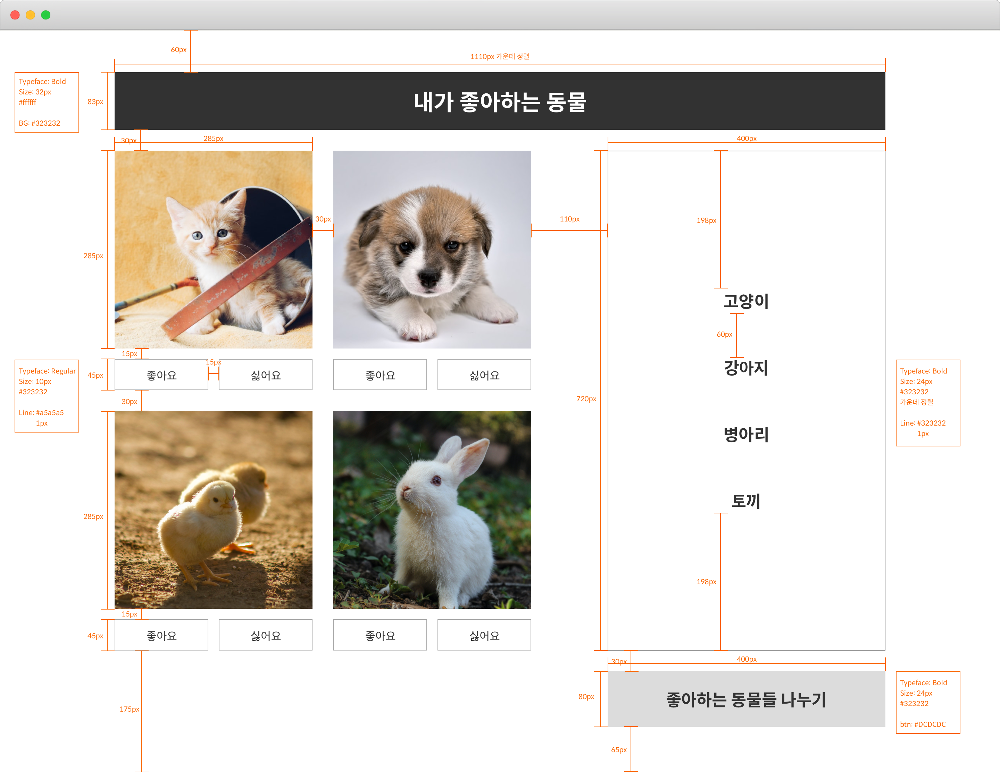
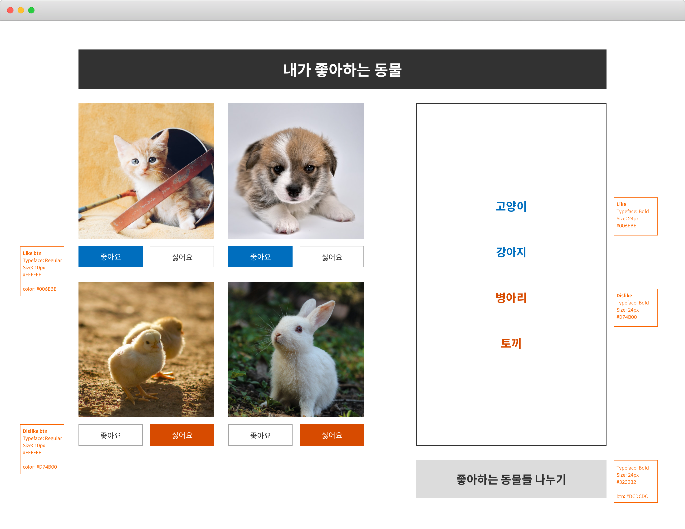
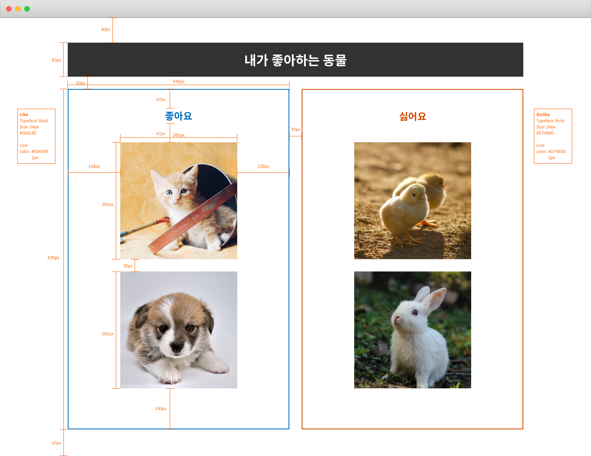

# 3billion web developer test

3billion 웹 개발자 코딩 테스트  
아래 4가지 테스트 요구사항은 구현해 주세요. "가점 요소"의 항목에 맞춰 작성하시면 가점이 있습니다. 

### 주의 사항
- react-router-dom 패키지가 package.json에 추가되어 있습니다. 
- 필요 시 react-redux, redux-thunk, redux-saga 패키지 사용이 가능합니다.
- css, less, sass, styled-component 어떤걸 사용해도 무방합니다.
- axios 와 같은 API 호출에 필요한 패키지는 사용 가능합니다.
- immutability를 위한 immer과 같은 패키지는 사용 가능합니다.
- 위와 관련한 패키지를 제외한 패키지는 사용을 금합니다.
- 최대한 화면에 명시되어 있는 것과 비슷하게 구현해주시면 됩니다.

### 가점 요소 
- Semantic HTML 사용
- css의 경우 pixel 단위의 하드 코딩보다 flexbox 또는 CSS Grid layout 을 이용한 정렬
- function component & hooks 사용
- data fetch를 위한 API 호출 시 데이터 로딩 표시
- 테스트 코드 작성

## 테스트 요구사항
<strong>0. test 작업 설정하기</strong>
  - git clone git@github.com:3billion/web-developer-test.git
  - yarn  # 패키지 설치하기
  
<strong>1. Main.js 구현하기</strong>
  - path "/" 에 아래의 그림과 동일한 화면이 나오도록 Main.js 파일을 구현해 주세요.
  - 화면에 필요한 그림의 url과 동물 이름은 [여기](https://script.google.com/macros/s/AKfycbyPyy60E8nj7nj9888cDkftRi65sbetnduLF-rnP0un3zZak6U/exec?delay=2)를 호출하시면 됩니다 ("/" 에 접속시 [여기](https://script.google.com/macros/s/AKfycbyPyy60E8nj7nj9888cDkftRi65sbetnduLF-rnP0un3zZak6U/exec?delay=2) 를 호출하도록 코드 작성). 
  - (가점 요소) 위 API를 호출해서 데이터를 불러오는데 2~3 초의 delay가 생깁니다. API가 호출되는 동안 데이터가 로딩되고 있다는 로딩 표시를 구현하세요. 로딩 표시가 어떤 형태든 상관없습니다.
  
  
<strong>2. Main.js 기능 넣기</strong>
  - path "/" 의 화면에서 아래와 그림과 같이 좋아요 버튼을 누르면 버튼에 파란색 배경, 하얀색 글자로 버튼이 변경되어야 합니다 (여러개의 좋아요 버튼을 누를 수 있습니다). 또한 오른쪽 동물 이름 리스트에 좋아요가 선택되어진 동물 이름의 글자 색이 파란색이 되어야 합니다.
  - 싫어요 버튼을 누르면 싫어요 버튼에 빨간색 배경, 하얀색 글자로 버튼이 변경이 되어야 합니다 (여러개의 좋아요 버튼을 누를 수 있습니다). 또한 오른쪽 동물 이름 리스트에 싫어요가 선택되어진 동물 이름의 글자 색이 빨간색이 되어야 합니다.
  

<strong>3. Classification.js 구현하기</strong>
  - path "/" 에서 '고양이', '강아지' 그림에 좋아요를 누르고 '병아리', '토끼' 그림에 싫어요를 누른 뒤 '좋아하는 동물들 나누기' 버튼을 누르면 path '/classification' 에 아래와 같은 그림이 나오도록 Classification.js 를 구현해주세요.
  

## Available Scripts

본 프로젝트는 [Create React App](https://github.com/facebook/create-react-app) 를 기반으로 만들어 졌습니다. 그렇기 때문에 기본 yarn 명령어가 작동됩니다

### `yarn start`

Runs the app in the development mode.\
Open [http://localhost:3000](http://localhost:3000) to view it in the browser.

The page will reload if you make edits.\
You will also see any lint errors in the console.

### `yarn test`

Launches the test runner in the interactive watch mode.\
See the section about [running tests](https://facebook.github.io/create-react-app/docs/running-tests) for more information.

### `yarn build`

Builds the app for production to the `build` folder.\
It correctly bundles React in production mode and optimizes the build for the best performance.

The build is minified and the filenames include the hashes.\
Your app is ready to be deployed!

See the section about [deployment](https://facebook.github.io/create-react-app/docs/deployment) for more information.
